# Workflow 引擎架构设计

## 概述

Workflow 引擎是 FenixAgent 平台的 DAG（有向无环图）工作流编排系统，支持可视化编辑、多节点类型并行执行、事件溯源持久化和崩溃恢复。

整个系统采用**四层一体的架构**：UI 层、应用层、服务层、引擎内核层，通过多种通信协议串联。

其中 UI 层的 **Chat 面板**与**工作流编辑器**深度集成，通过 `scenePrompt`（场景提示词）和 `Context Queue`（运行时上下文队列）两种机制，将工作流元信息、编辑器选中状态、运行结果实时注入 Chat 消息，使 Agent 能感知当前工作流的完整上下文。详见[第 4 章 Agent 创建工作流](#4-ui-层-chat-与工作流编辑器的交互)。

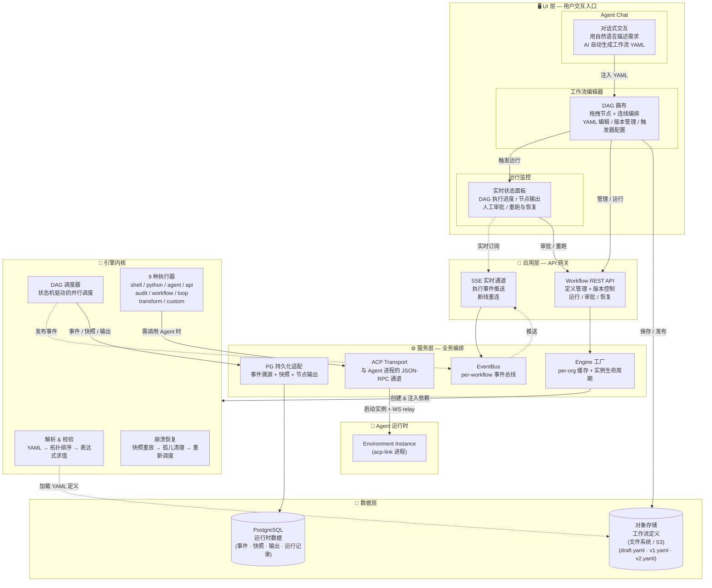

**核心设计原则**：

1. **"文件夹即项目"** — 用户产出物（YAML）是纯文件，可通过 git 版本控制；存储层通过文件系统或 S3 适配，运行时数据通过数据库持久化
2. **事件溯源（Event Sourcing）** — 状态从事件流重建，支持崩溃恢复和审计追溯
3. **调度与存储分离** — DAGScheduler 纯内存执行，通过 StorageAdapter 接口与数据库交互

---

## 1. 分层架构

### 1.1 UI 层

前端提供三个核心页面组成工作流的交互闭环：

| 页面 | 功能 |
|------|------|
| **工作流列表** | 浏览、创建、删除工作流，支持搜索和批量恢复 |
| **DAG 编辑器**（核心） | 可视化拖拽编排节点和连线、YAML 编辑、版本发布、触发器管理 |
| **版本历史** | 浏览所有发布版本、查看 YAML 内容、恢复历史版本到草稿 |

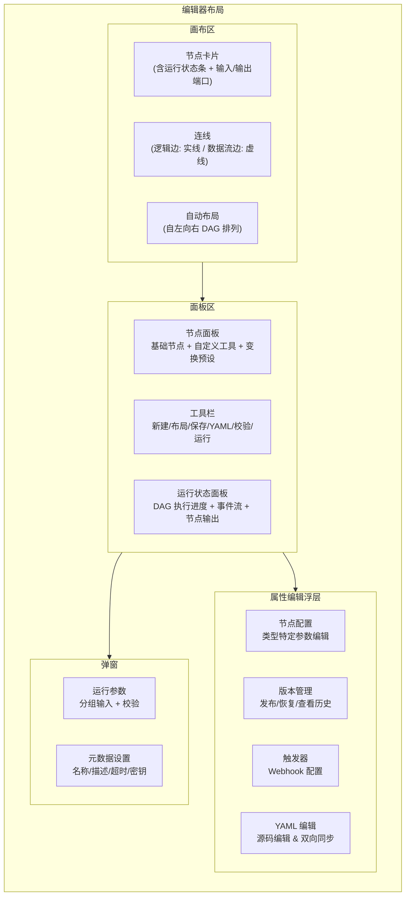

**编辑器核心能力**：

- **画布交互** — 拖拽添加节点、连线添加依赖（自动补全 inputs）、删除、ID 变更
- **持久化** — YAML 双向序列化/反序列化、3s 防抖自动保存草稿、导入/导出 YAML 文件
- **运行控制** — dryRun 校验、run 执行、2s 轮询快照、取消/审批/从节点重跑
- **数据流感知** — 自动扫描 `${{ nodes.X.output.Y }}` 表达式，在画布上生成绿色数据流边

---

### 1.2 应用层 (API)

所有 API 通过统一的**认证插件**进行多租户隔离，从请求上下文提取 `{ userId, organizationId }`。

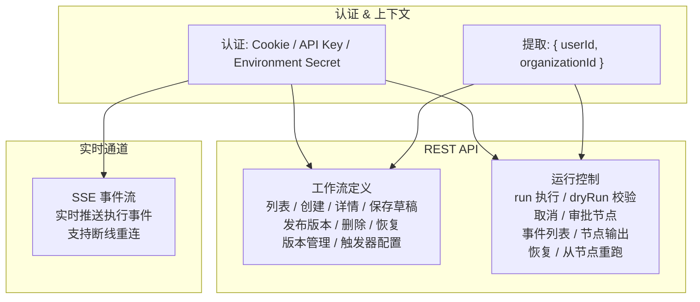

---

### 1.3 引擎内核层

引擎内核是一个独立的包，通过接口（`Transport`、`StorageAdapter`）与外部系统解耦，内部由四个核心模块组成：

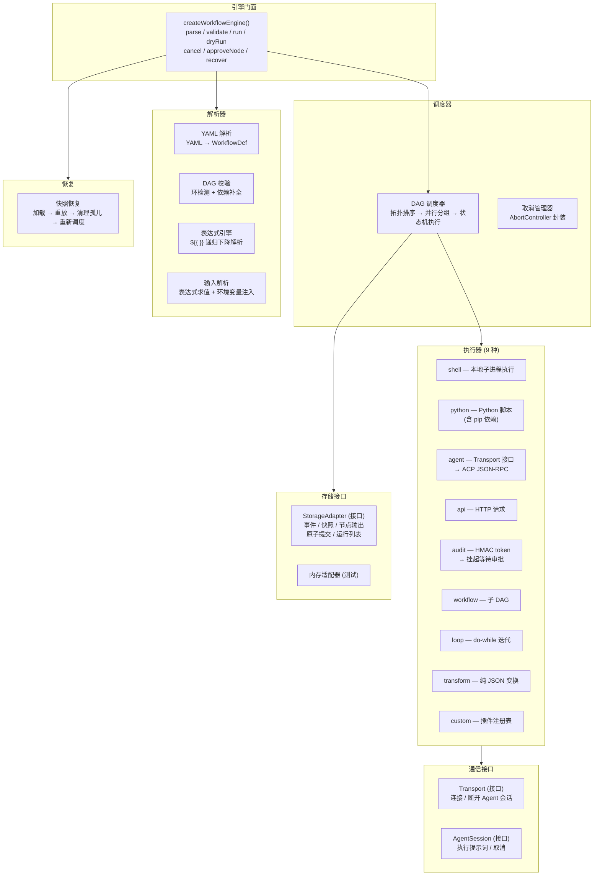

---

## 2. DAG 执行模型

### 2.1 调度循环

DAGScheduler 是整个引擎的核心，采用**纯内存状态机**模型：


**关键调度特性**：

- **并行扇出**：同层级无依赖的节点同时执行
- **错误传播**：节点失败时 BFS 遍历下游 → 标记所有下游节点为 `SKIPPED` → 其他分支继续执行
- **条件执行**：`condition: "${{ params.go }}"` 通过表达式求值判断是否跳过
- **输出注入**：节点声明 `outputs.pattern` 在执行成功后求值，合并到 `output.json`

### 2.2 节点生命周期

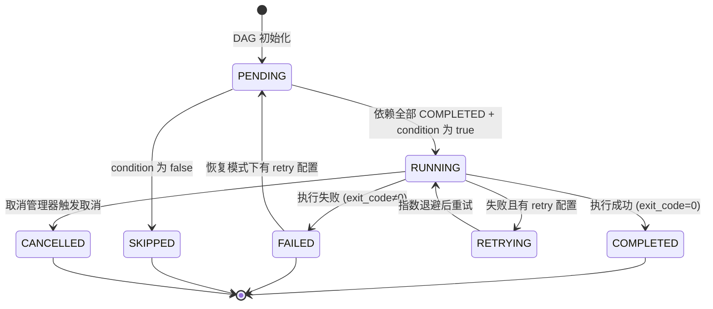

### 2.3 表达式引擎

手写递归下降解析器，支持以下语法：

```javascript
// 命名空间
nodes.<id>.output.xxx     // 上游节点输出
nodes.<id>.status         // 节点执行状态
params.xxx                // 工作流参数
secrets.KEY               // 声明的密钥 (运行时从环境变量解析)

// 数据结构
nodes.step1.output.stdout           // 标量
nodes.step1.output.messages[0]      // 数组索引

// 运算符
==  !=  >  <  >=  <=  &&  ||  +  !

// 三元
condition ? value1 : value2

// 模板拼接
"${{ params.outdir }}/${{ params.filename }}.txt"
```

**安全限制**：
- 表达式最大长度 1024 字符
- 访问深度限制 10 层
- 禁止 `__proto__`、`constructor`、`prototype` 访问
- 仅允许 `nodes`、`params`、`secrets` 根命名空间

---

## 3. 事件溯源与崩溃恢复

### 3.1 事件模型

系统通过**事件 → 快照 → 节点输出**三层存储实现完整的审计追溯和状态重建：

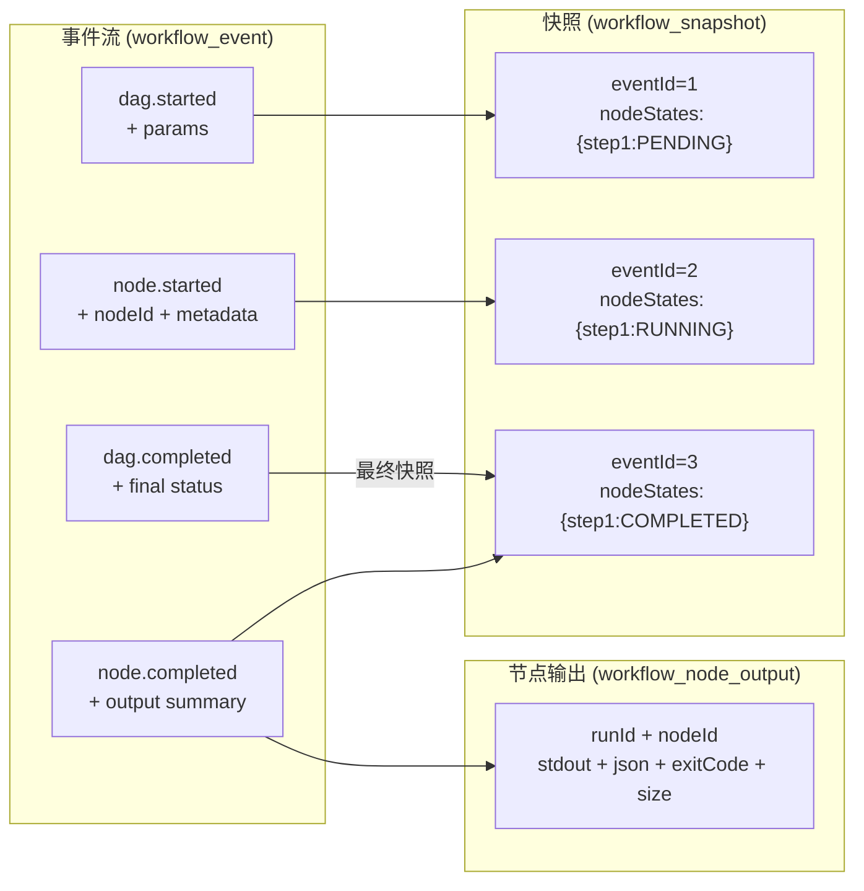

### 3.2 崩溃恢复流程

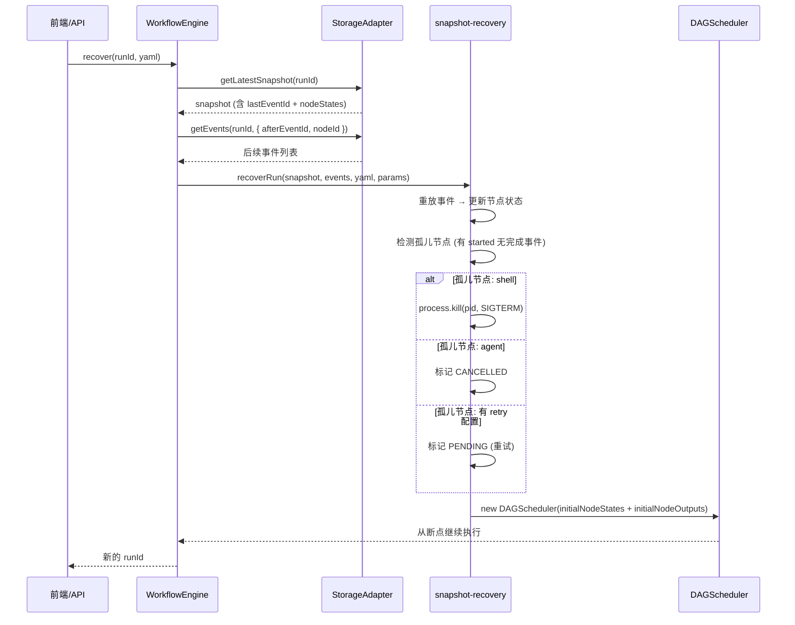

**rerunFrom**（从指定节点重跑）：
1. 从原 run 的 dag.started 事件获取原始 params
2. BFS 查找 `fromNodeId` 的下游节点
3. 保留上游 COMPLETED 节点的 output
4. 生成新 `runId`，仅重跑下游子图

---

## 4. UI 层 Chat 与工作流编辑器的交互

WorkflowEditor 将 Chat 面板**直接内嵌**在编辑器左侧。用户可在编辑工作流的同时与 Agent 对话，Agent 能感知编辑器中的实时上下文（选中节点、运行状态、错误信息）。

### 4.1 嵌入架构

Chat 和 Workflow 之间通过两条路径双向通信：

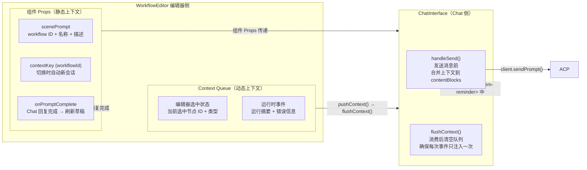

### 4.2 上下文注入机制

Chat 在每次发送用户消息前（`ChatInterface.handleSend()`），会将工作流上下文注入到消息的 `contentBlocks` 最前端。注入内容对用户不可见，封装在 `<system-reminder>` 标签中。

#### 场景提示词（scenePrompt）— 仅首次

由 `useWorkflowMetaAgent` 生成，在第一条消息时注入，包含工作流的基本元信息：

```
[Workflow Context]
- Workflow ID: wf_abc123
- Workflow Name: 数据分析流水线
- Workflow Description: 从数据库提取数据，进行清洗和聚合分析
You can describe a workflow in natural language and I will help you create and modify the DAG diagram.
```

#### 上下文队列（Context Queue）— 每次发送前

全局队列存储工作流上下文片段，编辑器运行时推入，Chat 在发送前一次性取出并清空。

**推送来源**：

| 推送时机 | 内容 |
|---------|------|
| 用户选中/切换节点 | `[Workflow Editor Context]`：工作流名称 + 选中节点 ID/类型 |
| 运行状态变化 | `[Workflow Event]`：运行摘要（如 "Run Failed (3/5, 2 failed: node_1, node_2)"） |
| dryRun 校验失败 | `[Workflow Event]`：validation error 消息 |
| 保存草稿失败 | `[Workflow Event]`：save error 消息 |
| 发布版本失败 | `[Workflow Event]`：publish error 消息 |

Chat 侧消费时的合并格式：

```
<system-reminder>
[Workflow Editor Context]
- Workflow Name: 数据分析流水线
- Selected Node: node_2 (type: agent)

[Workflow Event]
Run Status: Run Failed (3/5 completed, 2 failed: node_1, node_2)
Error (validation): Node 'node_3' depends_on references unknown node 'node_x'
</system-reminder>
```

#### Chat 回复完成回调

Chat 每结束一轮 prompt 回复，通知编辑器刷新草稿，确保 Agent 在对话中生成或修改的 YAML 已被后端持久化后，编辑器能从存储层重新加载最新内容。

### 4.3 Meta Agent 辅助创建

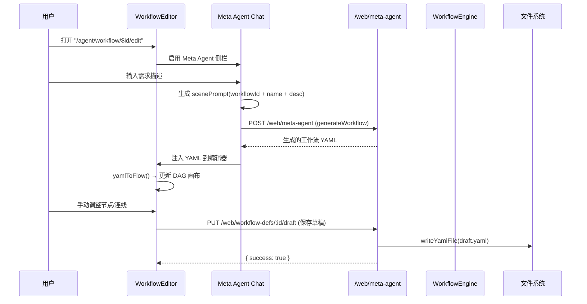

**Meta Agent 核心机制** (`useWorkflowMetaAgent`)：

- `scenePrompt` 包含 `workflowId`、`name`、`description` 等上下文
- Meta Agent 本身是一个 Agent Environment，具备生成 YAML 的能力
- 生成的 YAML 直接注入编辑器，用户可后续手动调整
- Meta Agent 的 Environment 实例通过 `meta-agent.ts` API 管理

### 4.4 Agent 节点在工作流中的角色

`agent` 类型节点是工作流执行 LLM 推理任务的核心方式：

```yaml
nodes:
  - id: analyze_data
    type: agent
    agent: "data-analyst"       # Agent Environment 名称 (非 AgentConfig)
    prompt: |
      分析以下数据并生成报告:
      ${{ nodes.fetch_data.output.json }}
    depends_on: [fetch_data]
    timeout: 600
    retry:
      count: 2
      delay: 1000
      backoff: exponential
    outputs:
      report:
        pattern: "${{ nodes.analyze_data.output.messages[-1].content }}"
        type: "string"
```

**关键设计**：
- `agent` 字段指向 **Environment 名称**（通过 `orgId + name` 查找），而非 AgentConfig ID
- prompt 支持 `${{ }}` 表达式，可引用上游节点输出和工作流参数
- 通过 ACP JSON-RPC 协议与 Agent 进程通信（见第 5 节）
- 默认 2 次指数退避重试，节点超时和 DAG 取消不重试

---

## 5. Workflow 建立沟通的设计

### 5.1 三层通信架构

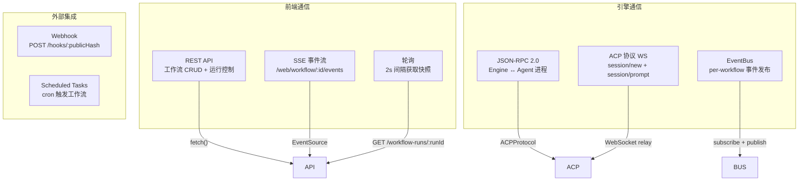

### 5.2 实时事件推送架构

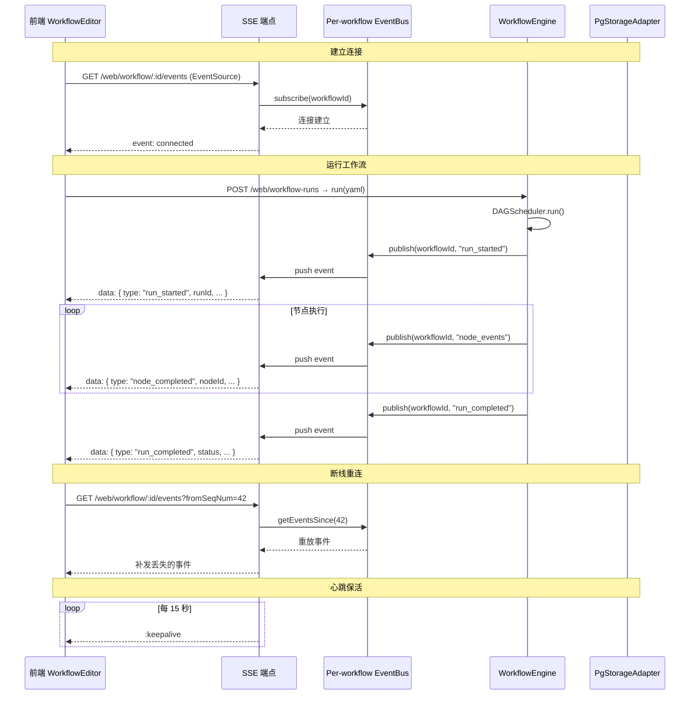

---

## 6. 数据模型

### 6.1 核心实体关系

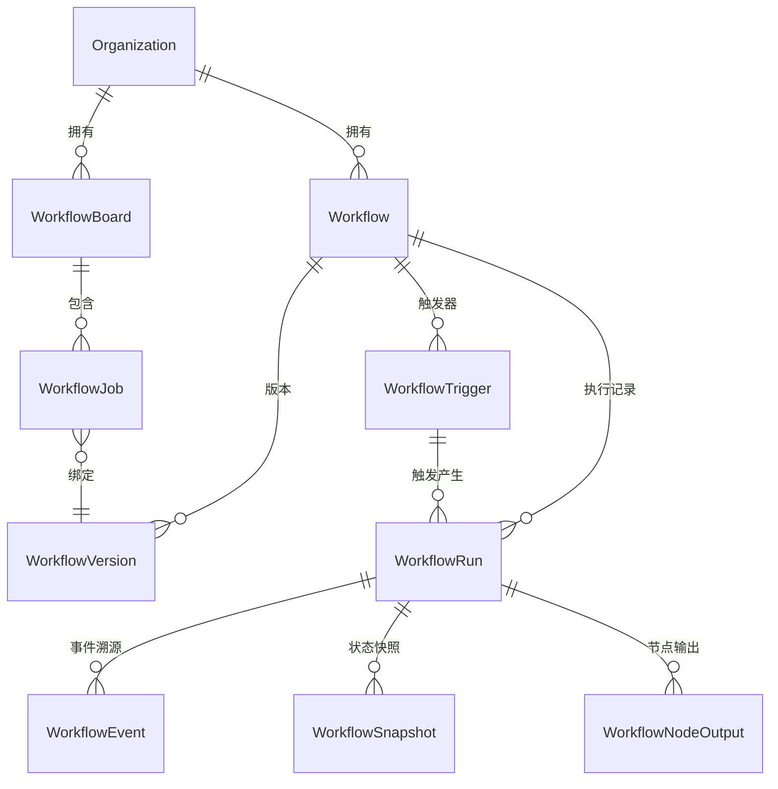

### 6.2 存储架构

工作流定义（YAML）存储在可替换的对象存储后端（默认为文件系统，可通过 S3 适配器扩展），运行时数据存储在 PostgreSQL。

```
对象存储 (文件系统 / S3):
  .agents/workflows/<organizationId>/<workflowId>/
  ├── draft.yaml             # 当前编辑草稿
  ├── v1.yaml                # 已发布版本 1 (不可变)
  ├── v2.yaml                # 已发布版本 2
  └── ...

PostgreSQL:
├── workflow               # 元数据 + latestVersion + storagePath
├── workflow_version       # 版本记录 (status: draft | published)
├── workflow_run           # 运行摘要 (status, input, output JSONB)
├── workflow_event         # 事件溯源 (eventId, runId, type, metadata JSONB)
├── workflow_snapshot      # 状态快照 (nodeStates JSONB, dagStatus)
├── workflow_node_output   # 节点输出 (stdout TEXT, json JSONB, exitCode)
├── workflow_board         # 看板面板
├── workflow_job           # 看板 Job (stage, status)
└── workflow_trigger       # Webhook 触发器 (publicHash UNIQUE, secret)
```

---

## 7. 关键设计决策

| 决策 | 理由 | 影响 |
|------|------|------|
| **"文件夹即项目"** | YAML 产物是纯文件，可通过 git 版本控制 | 工作流定义天然可审计和回滚 |
| **事件溯源** | 状态从事件流 + 快照重建 | 支持崩溃恢复、断线重连、审计追溯 |
| **纯内存调度** | DAGScheduler 状态在内存，通过接口写 DB | 调度性能不受 DB 延迟影响 |
| **Transport 接口抽象** | 引擎不感知具体通信协议 | 可替换通信层（如 gRPC、本地调用） |
| **StorageAdapter 接口抽象** | 引擎不依赖具体数据库 | 测试用内存实现，生产用 PG |
| **per-org Engine 缓存** | 按 orgId 缓存 `{engine, transport}` | 避免跨组织数据泄露，减少重复创建开销 |
| **Secrets 脱敏** | 事件 metadata 中脱敏 secrets | 避免密钥在事件流中泄露 |

---

## 8. 后续演进方向

1. **分布式调度**：当前 DAGScheduler 是单进程调度，无法跨节点水平扩展。后续可引入消息队列（如 Redis Streams）实现分布式节点调度
2. **更丰富的条件控制**：表达式引擎当前仅支持基础运算符，可扩展为完整 DSL
3. **动态并行与 reduce**：支持动态基于上游输出的并行分支和聚合操作
4. **循环迭代增强**：loop 节点当前 break 条件较简单，可增强为完整的 for/while/do-while 三态
5. **快照压缩**：频繁快照积累大量数据，需要定期压缩策略
6. **工作流模板市场**：支持组织间分享工作流模板
