# Workflow 引擎架构设计

## 概述

Workflow 引擎是 FenixAgent 平台的 DAG（有向无环图）工作流编排系统，支持可视化编辑、多节点类型并行执行、事件溯源持久化和崩溃恢复。

整个系统采用**分层架构**：UI 层 → API 网关 → 服务层 → 引擎内核 → 数据层，通过多种通信协议串联。

编辑器内嵌 Chat 面板，通过事件机制和消息队列实现上下文感知交互。详见[§1.1.1 Chat 与 Workflow 交互](#111-chat-与-workflow-交互)。

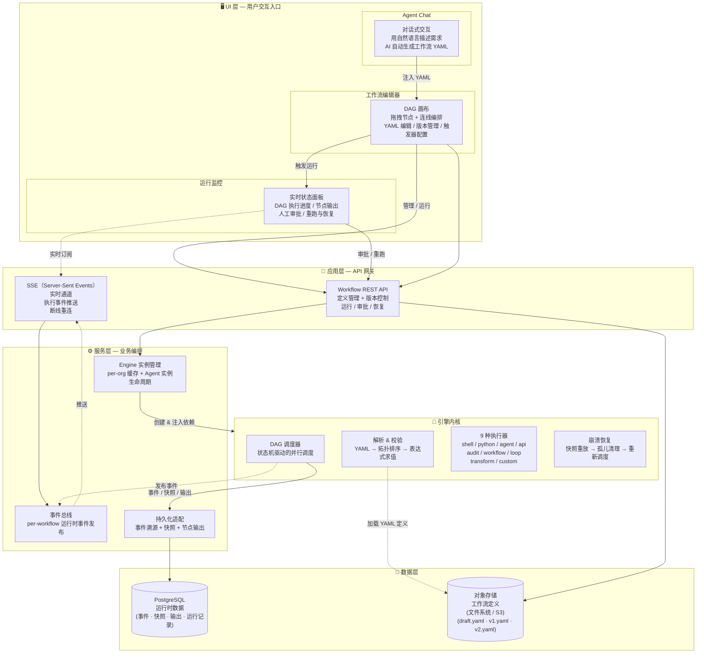

---

## 1. 分层架构

### 1.1 UI 层

前端提供三个核心页面组成工作流的交互闭环：

| 页面 | 功能 |
|------|------|
| **工作流列表** | 浏览、创建、删除工作流，支持搜索和批量恢复 |
| **DAG 编辑器**（核心） | 可视化拖拽编排节点和连线、YAML 编辑、版本发布、触发器管理 |
| **版本历史** | 浏览所有发布版本、查看 YAML 内容、恢复历史版本到草稿 |

**编辑器核心能力**：

- **画布交互** — 拖拽添加节点、连线添加依赖（自动补全 inputs）、删除、ID 变更
- **持久化** — YAML 双向序列化/反序列化、3s 防抖自动保存草稿、导入/导出 YAML 文件
- **运行控制** — dryRun 校验、run 执行、2s 轮询快照、取消/审批/从节点重跑
- **数据流感知** — 自动扫描 `${{ nodes.X.output.Y }}` 表达式，在画布上生成绿色数据流边

#### 1.1.1 Chat 与 Workflow 交互

Chat 和 Workflow 编辑器之间**仅存在前端层面的数据传递，后端无任何耦合**。两者的交互完全发生在浏览器端，后端 API 各自独立运行。

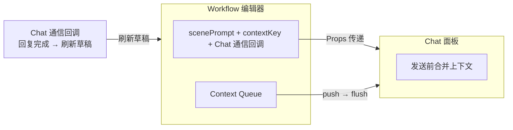

**交互机制**：

Workflow 编辑器通过事件机制将上下文变化推送到 Chat 端（选中节点、运行事件、校验/保存错误等），Chat 组件内部维护一个消息队列，在用户每次发送消息前将队列中的上下文一次性取出并合并到消息体中，确保 Agent 能感知编辑器的实时状态。

**后端独立性**：

- Chat 面板使用通用的 Agent Chat 后端 API（`/acp/relay`），不依赖任何 Workflow 专用接口
- Workflow 编辑器使用 Workflow REST API，不依赖任何 Chat 专用接口
- 两者可以独立部署、独立开发、独立替换，互不影响

---

### 1.2 应用层 (API)

#### 1.2.1 REST API

所有 API 通过统一的**认证插件**进行多租户隔离，从请求上下文提取 `{ userId, organizationId }`。

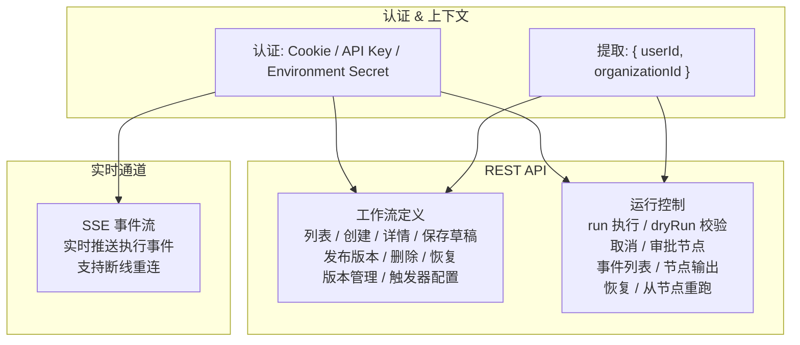

#### 1.2.2 实时事件推送 (SSE)

应用层通过 SSE 实现 Workflow 执行事件的实时推送：

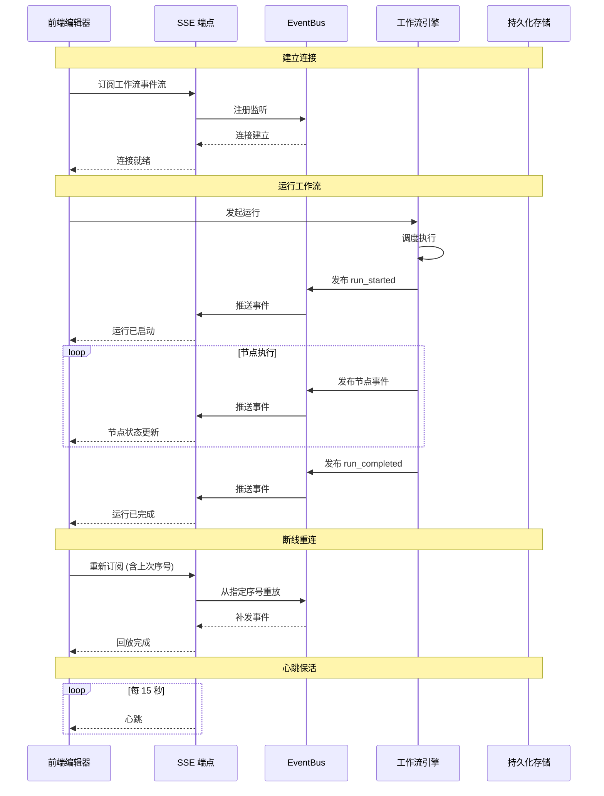

---

### 1.3 引擎内核层

引擎内核是一个独立的模块，通过接口与外部系统解耦，内部形成一个**解析 → 调度 → 执行 → 持久化**的清晰流水线：

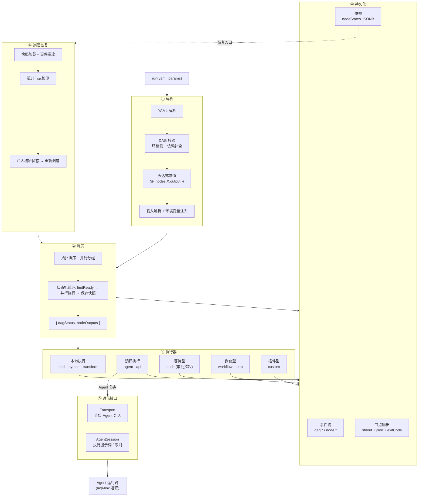

---

## 2. DAG 执行模型

### 2.1 调度循环

DAGScheduler 是整个引擎的核心，采用**纯内存状态机**模型：

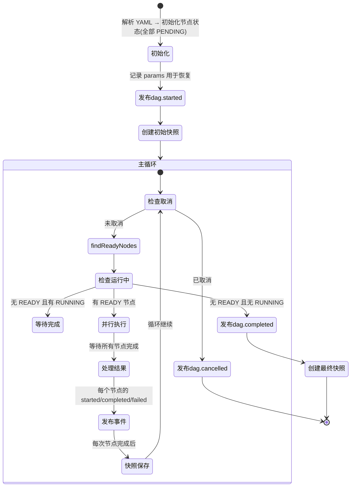

**关键调度特性**：

- **并行扇出**：同层级无依赖的节点同时执行
- **错误传播**：节点失败时 BFS（广度优先搜索）遍历下游 → 标记所有下游节点为 `SKIPPED` → 其他分支继续执行
- **条件执行**：`condition: "${{ params.go }}"` 通过表达式求值判断是否跳过
- **输出注入**：节点声明 `outputs.pattern` 在执行成功后求值，合并到 `output.json`

### 2.2 节点生命周期

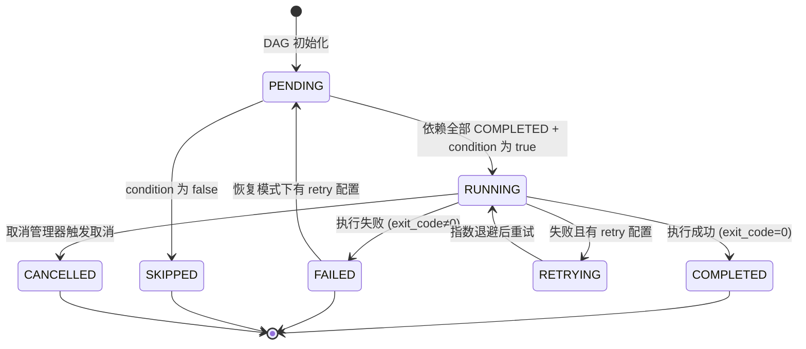

### 2.3 表达式引擎

手写递归下降解析器，支持以下语法：

```javascript
// 命名空间
nodes.<id>.output.xxx     // 上游节点输出
nodes.<id>.status         // 节点执行状态
params.xxx                // 工作流参数
secrets.KEY               // 声明的密钥 (运行时从环境变量解析)

// 数据结构
nodes.step1.output.stdout           // 标量
nodes.step1.output.messages[0]      // 数组索引

// 运算符
==  !=  >  <  >=  <=  &&  ||  +  !

// 三元
condition ? value1 : value2

// 模板拼接
"${{ params.outdir }}/${{ params.filename }}.txt"
```

**安全限制**：
- 表达式最大长度 1024 字符
- 访问深度限制 10 层
- 禁止 `__proto__`、`constructor`、`prototype` 访问
- 仅允许 `nodes`、`params`、`secrets` 根命名空间

---

## 3. 事件溯源与崩溃恢复

### 3.1 事件模型

系统通过**事件 → 快照 → 节点输出**三层存储实现完整的审计追溯和状态重建：

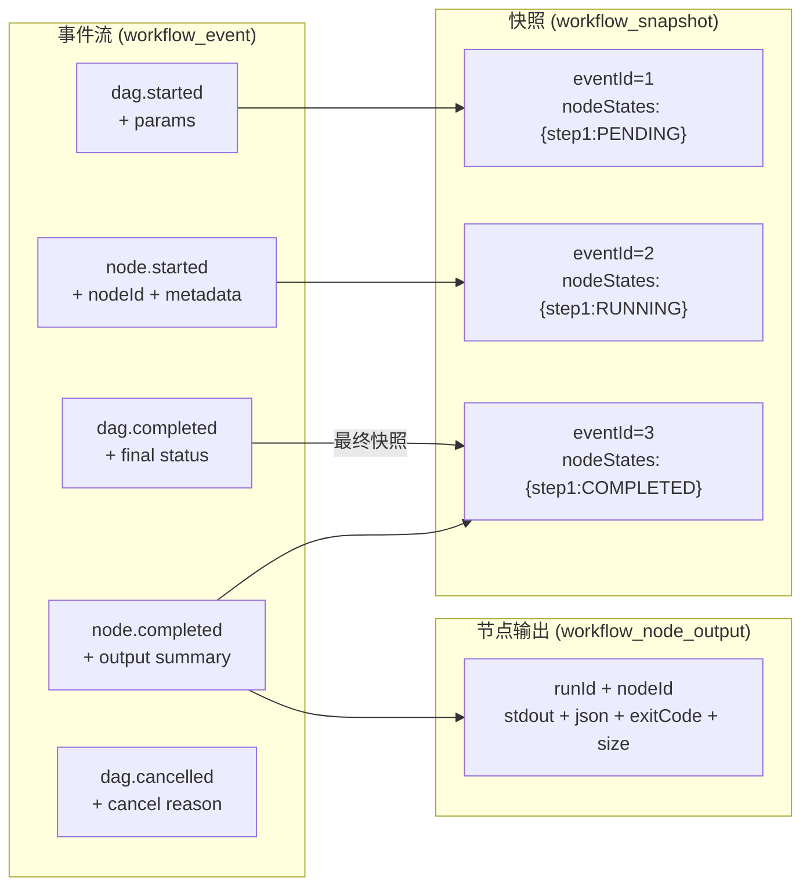

### 3.2 崩溃恢复流程

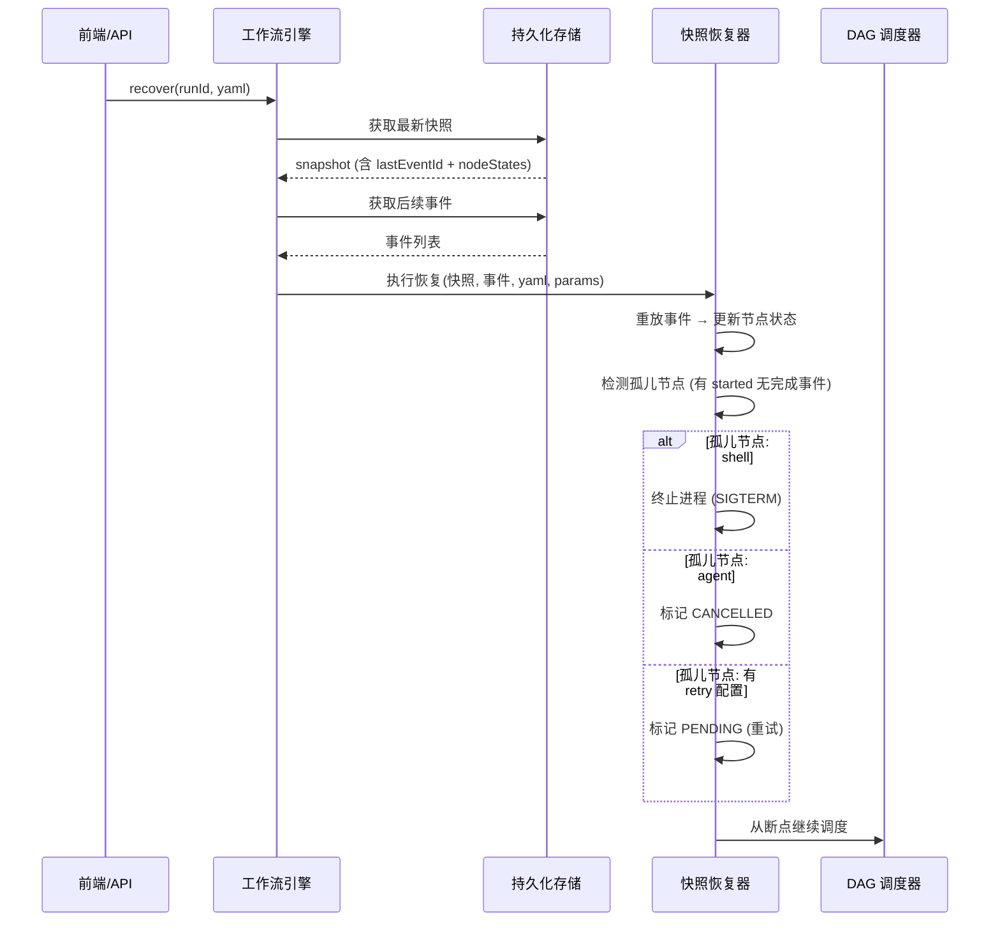

**rerunFrom**（从指定节点重跑）：
1. 从原 run 的 dag.started 事件获取原始 params
2. BFS（广度优先搜索）查找 `fromNodeId` 的下游节点
3. 保留上游 COMPLETED 节点的 output
4. 生成新 `runId`，仅重跑下游子图

---

## 4. 数据模型

### 4.1 核心实体关系

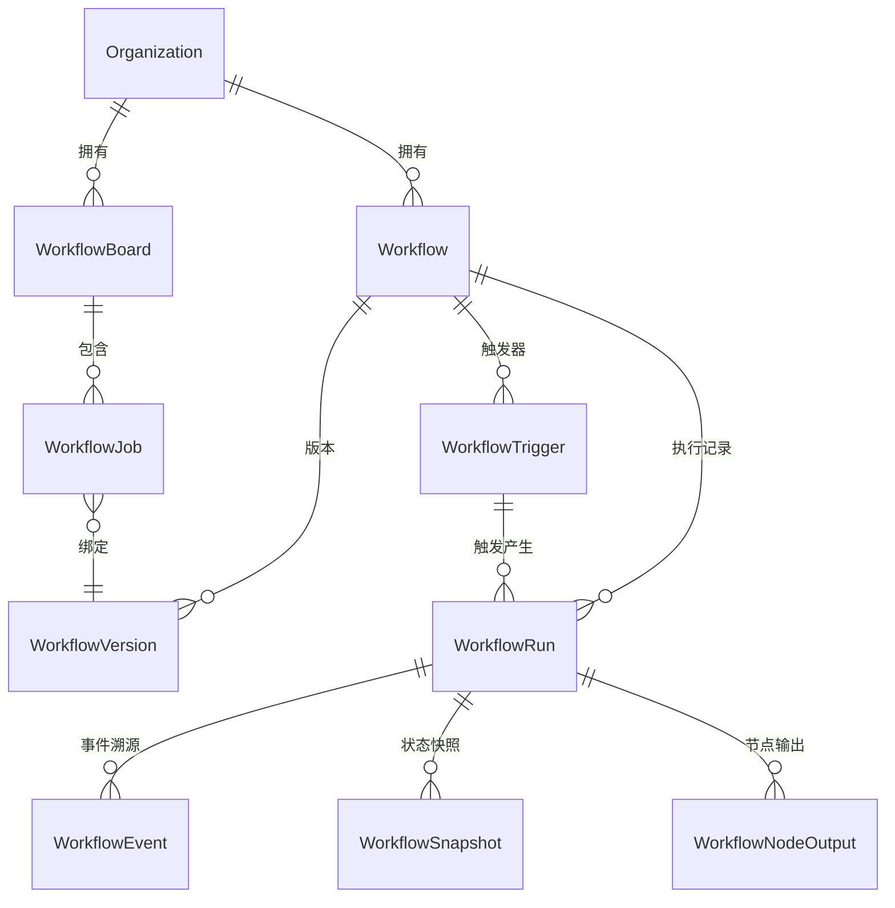

### 4.2 存储架构

工作流定义（YAML）存储在可替换的对象存储后端（默认为文件系统，可通过 S3 适配器扩展），运行时数据存储在 PostgreSQL。其中 `JSONB` 是 PostgreSQL 的二进制 JSON 数据类型，允许在字段上建索引和高效查询。

```
对象存储 (文件系统 / S3):
  .agents/workflows/<organizationId>/<workflowId>/
  ├── draft.yaml             # 当前编辑草稿
  ├── v1.yaml                # 已发布版本 1 (不可变)
  ├── v2.yaml                # 已发布版本 2
  └── ...

PostgreSQL:
├── workflow               # 元数据 + latestVersion + storagePath
├── workflow_version       # 版本记录 (status: draft | published)
├── workflow_run           # 运行摘要 (status, input, output JSONB)
├── workflow_event         # 事件溯源 (eventId, runId, type, metadata JSONB)
├── workflow_snapshot      # 状态快照 (nodeStates JSONB, dagStatus)
├── workflow_node_output   # 节点输出 (stdout TEXT, json JSONB, exitCode)
├── workflow_board         # 看板面板
├── workflow_job           # 看板 Job (stage, status)
└── workflow_trigger       # Webhook 触发器 (publicHash UNIQUE, secret)
```

---

## 5. 独立部署方案

Workflow 引擎的核心模块本身解耦，可以直接作为独立服务运行。独立部署时，Workflow 引擎作为**纯编排引擎**，通过 API 与外部系统交互。

### 5.1 架构总览

```
┌──────────────────────────────────────────────────────┐
│                   Workflow 独立服务                    │
│                                                      │
│  ┌──────────┐  ┌──────────┐  ┌──────────┐           │
│  │ REST API │  │   SSE    │  │ EventBus │           │
│  └────┬─────┘  └────┬─────┘  └────┬─────┘           │
│       │             │             │                  │
│  ┌────▼─────────────▼─────────────▼─────┐            │
│  │          DAGScheduler                │            │
│  │  shell / python / agent / api        │            │
│  │  audit / workflow / loop / custom    │            │
│  └────────────────┬─────────────────────┘            │
│                   │                                  │
│  ┌────────────────▼─────────────────────┐            │
│  │  存储适配器 (PG / 内存)               │            │
│  │  事件溯源 + 快照 + 节点输出           │            │
│  └──────────────────────────────────────┘            │
└──────────────────────────────────────────────────────┘
         │【前端交互：scenePrompt + Context Queue + Chat 通信回调】
         ▼
┌──────────────────────────────────────────────────────┐
│                   外部 Chat 系统                      │
└──────────────────────────────────────────────────────┘
```

### 5.2 与外部 Chat 通信

独立部署后，外部 Chat 系统通过前端和后端两层与 Workflow 独立服务通信：

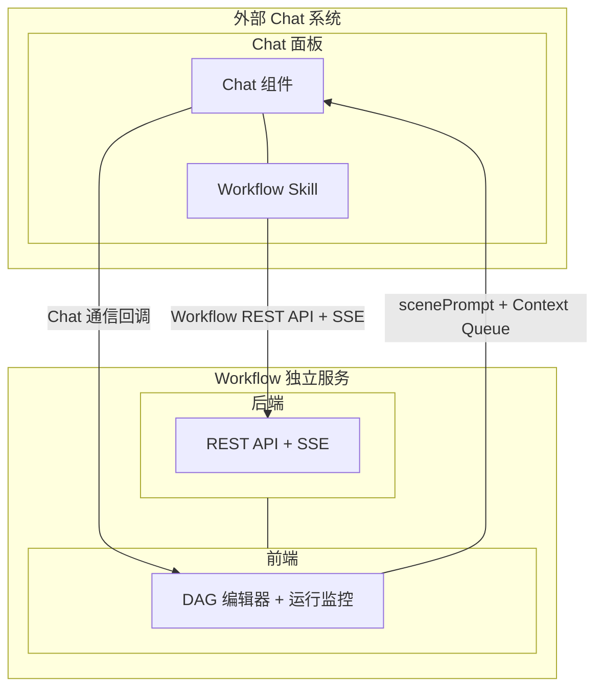

**前端通信**：外部 Chat 面板以 `<iframe>` 嵌入 Workflow 编辑器，通过 Props（`scenePrompt`、`contextKey`、Chat 通信回调）和 Context Queue 双向通信，与 [1.1.1](#111-chat-与-workflow-交互) 模式一致。

**后端通信**：外部 Chat 基于 Workflow API Skill（`/.agents/skills/agent-platform-api/references/workflow.md`）调用 Workflow 独立服务的 REST API 和 SSE，进行工作流创建/编辑/运行/监控等操作。

### 5.3 工作流即 API 调用

独立部署后，外部系统可通过 `POST /api/workflows/:workflowId/execute` 像调用函数一样触发工作流。定义见 `src/schemas/api-workflow.schema.ts`。

**请求体**：

| 字段 | 类型 | 必填 | 说明 |
|------|------|------|------|
| `inputs` | object | 否 | 对应 YAML 中 `params` 定义的字段值 |
| `mode` | `"sync"` / `"async"` | 否 | 默认 `sync` |
| `version` | number | 否 | 指定工作流版本号，不传使用 `latestVersion` |
| `timeout` | number | 否 | sync 模式最大等待秒数，默认 300，上限 3600 |

**响应输出**：

| mode | 字段 | 说明 |
|------|------|------|
| **sync** | `runId`、`status`、`version`、`duration`、`output?`、`error?` | 阻塞等待完成。`status` 为 `SUCCESS` / `FAILED` / `TIMEOUT` |
| **async** | `runId`、`version` | 立即返回，后续通过 `/web/workflow-engine` 异步查询结果 |

### 5.4 YAML 工作流定义

Workflow 引擎通过 YAML 声明式定义 DAG 编排逻辑。完整的 API 参考、YAML Schema、节点类型定义及故障排查，参见 Workflow API Skill（`/.agents/skills/agent-platform-api/references/workflow.md`）。
