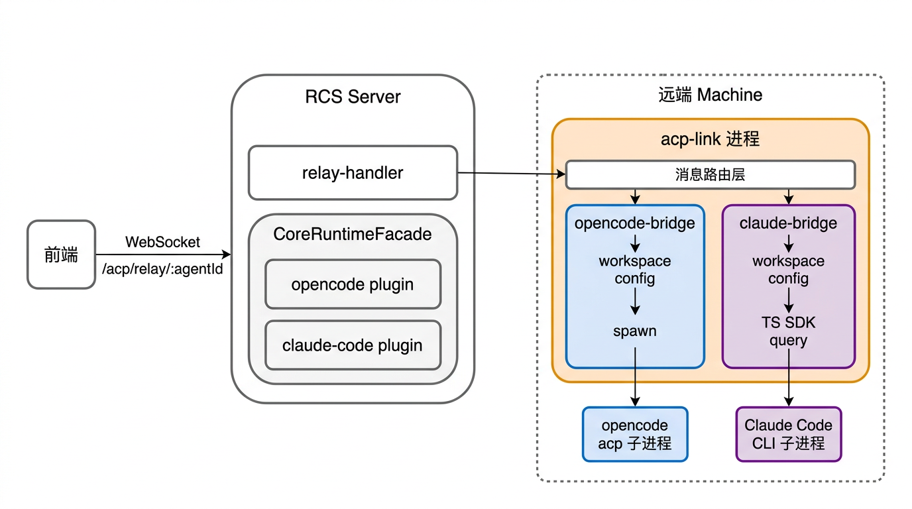

# Feature: 20260601_F001 - dual-engine-support

## 需求背景

当前 RCS 只支持 **opencode** 作为唯一的 agent 执行引擎。代码中至少 6 个关键文件硬编码 `engineType: "opencode"`（`core-bootstrap.ts`、`instance.ts`、`agent-task-runner.ts`、`src/index.ts`、`acp-link/instance-manager.ts`、`acp-link/session-manager.ts`），且 `@fenix/opencode` 包被 RCS 服务层和 acp-link 直接引用。

**问题**：

1. **单一引擎限制** — 无法运行 Claude Code、Cursor 等 AI CLI 工具，用户选择受限
2. **架构债务** — plugin-sdk/core 已有引擎无关的抽象接口（EnginePlugin、EngineRuntime、EngineRelayHandle），但所有调用方硬编码 opencode，抽象层未被充分利用
3. **配置耦合** — workspace 目录 `.opencode/`、配置文件 `opencode.json`、进程管理 `opencode acp` 等散布在多处，难以参数化
4. **隐式适配层** — acp-link 中 `instance-manager.ts` 和 `session-manager.ts` 包含大量 opencode 专有逻辑（workspace 配置准备、ACP session 创建行为、系统提示注入、权限硬编码），但没有作为显式适配层封装。这导致 acp-link 不是纯粹的 ACP 中继，而是混杂了 opencode 适配逻辑

**契机**：Anthropic 发布了 **Claude Agent SDK (TypeScript)**，版本 0.2.112（npm 包 `@anthropic-ai/claude-agent-sdk`），提供 `query()` 函数 spawn Claude Code CLI、AsyncGenerator 流式输出、MCP 透传、session 管理、permission 控制、自定义 `spawnClaudeCodeProcess` 和 `pathToClaudeCodeExecutable` 等完整能力。可以在 TypeScript/Bun 项目中直接使用，无需额外的 Python 运行时。

## 目标

- **双引擎共存**：opencode 和 claude-code 同时可用，每个 Agent 配置时选择 `engineType` + `machineId`
- **全面清理架构债务**：将所有 `engineType: "opencode"` 硬编码替换为动态读取，标准化 EngineRelayHandle 扩展，参数化 workspace 目录约定
- **acp-link 代码重组**：将 acp-link 中的 opencode 适配逻辑（instance-manager/session-manager）抽取为 `@fenix/opencode-bridge` 包，acp-link 变为 bridge 模块的调度器和 WS ↔ bridge 消息路由层
- **双桥接层架构**：opencode 有 `@fenix/opencode-bridge`，claude-code 有 `@fenix/claude-bridge`，两者是 acp-link 进程内的代码模块，运行时同一进程。代码上独立包，职责上各自封装引擎差异
- **远端运行**：Claude Code 在远端 machine 上通过 acp-link 进程内的 `claude-bridge` 模块 spawn Claude Code CLI 子进程，bridge 模块内部做 ACP ↔ stream-json 协议转换
- **本地运行**：Claude Code 也可在 RCS 服务器本地 spawn acp-link 进程（内含 claude-bridge 模块），通过 `@fenix/plugin-claude-code` 管理
- **agent-task-runner 同步改造**：定时任务执行支持双引擎
- **CLI 版本可控**：`claude-bridge` 模块可通过环境变量 `CLAUDE_CODE_CLI_PATH` 指定 Claude Code CLI 路径
- **前端最小改动**：只加 engineType 下拉选择和引擎图标

## 方案设计

### 整体架构变更

**改造前**（单引擎路径）：

```
前端 ↔ /acp/relay/:agentId ↔ relay-handler
  → CoreRuntimeFacade → opencode plugin → opencode acp (本地)
  或 → machine WS → acp-link → opencode acp (远端)
```

**改造后**（双桥接层架构）：

```
前端 ↔ /acp/relay/:agentId ↔ relay-handler
  ├── engineType="opencode"
  │   → CoreRuntimeFacade → opencode plugin → acp-link进程(内含opencode-bridge模块) → opencode acp 子进程
  │   或 → machine WS → acp-link进程(内含opencode-bridge模块) → opencode acp 子进程
  └── engineType="claude-code"
      → CoreRuntimeFacade → claude-code plugin → acp-link进程(内含claude-bridge模块) → Claude Code CLI 子进程
      或 → machine WS → acp-link进程(内含claude-bridge模块) → Claude Code CLI 子进程
```



数据流（远端 Claude Code 场景）：

```
前端 ↔ /acp/relay/:agentId ↔ relay-handler ↔ machine WS ↔ acp-link进程 ↔ claude-bridge模块 ↔ Claude Code CLI 子进程
```

数据流（远端 opencode 场景）：

```
前端 ↔ /acp/relay/:agentId ↔ relay-handler ↔ machine WS ↔ acp-link进程 ↔ opencode-bridge模块 ↔ opencode acp 子进程
```

**关键设计原则**：

- **bridge 是代码模块，不是独立进程** — opencode-bridge 和 claude-bridge 作为代码模块存在于 acp-link 进程内部，运行时和 acp-link 是同一个进程，只是代码上分了不同包
- **acp-link 是 ACP 中继 + bridge 调度器** — acp-link 负责 WS ↔ bridge 模块的消息路由，bridge 模块负责引擎特有的环境准备和 agent 子进程管理
- **双桥接层** — 每个引擎有独立的桥接模块，封装该引擎特有的环境准备、子进程 spawn、和 ACP 协议使用方式
- **新增引擎只需新桥接模块** — 未来添加第三引擎（如 Cursor）只需开发对应的 bridge 模块包，acp-link 和 RCS 无需修改

### 新增模块：opencode-bridge

**位置**：`packages/opencode-bridge/`（workspace 包）

**性质**：acp-link 进程内部的代码模块，封装 opencode 的 ACP 桥接逻辑。**代码上独立包，运行时和 acp-link 同进程**

**来源**：从 `acp-link/src/client/instance-manager.ts` 和 `session-manager.ts` 中抽取 opencode 专有代码

**与 acp-link 的关系**：acp-link 通过 `import` 引用 opencode-bridge 模块，根据 `engine_type` 选择对应的 bridge 模块来管理 agent 子进程。bridge 模块负责环境准备 + spawn 子进程 + ACP 消息路由，acp-link 负责 WS ↔ bridge 模块之间的消息转发。

**从 acp-link 中迁移的逻辑**：

| 原 acp-link 代码 | 移到 opencode-bridge | 说明 |
|---|---|---|
| `instance-manager.ts` 的 `@fenix/opencode` import | 适配器内部的 opencode 配置准备 | buildOpencodeRuntimeConfig、installSkills、writeOpencodeConfig |
| `instance-manager.ts` 的 `prepare()` | 适配器的初始化阶段 | workspace 目录创建、配置文件写入 |
| `instance-manager.ts` 的 `start()` | 适配器的 spawn + ACP 连接建立 | spawn opencode acp、initialize handshake |
| `session-manager.ts` 的 `ClientSideConnection` | 适配器的 ACP 客户端 | initialize、newSession、prompt、cancel |
| `session-manager.ts` 的自动创建 session | 适配器的 session 生命周期 | 初始化后 auto newSession |
| `session-manager.ts` 的系统提示注入 | 适配器的 prompt 增强 | `blocks.unshift({ type: "text", text: systemPrompt })` |
| `session-manager.ts` 的硬编码权限 | 适配器的权限策略 | `requestPermission` → always allow |

**内部架构**（运行在 acp-link 进程内）：

```
acp-link 进程
┌──────────────────────────────────────────────────────────┐
│  RCS WebSocket 连接层                                    │
│  ↓ 消息路由：根据 engine_type 选择 bridge 模块           │
│                                                          │
│  ┌── opencode-bridge 模块 ──────────────────────────┐   │
│  │  Workspace 配置准备                               │   │
│  │    - mkdir .opencode                              │   │
│  │    - installSkills                                │   │
│  │    - writeOpencodeConfig                          │   │
│  │  ↓                                                │   │
│  │  spawn opencode acp 子进程                        │   │
│  │  ↓                                                │   │
│  │  ACP ClientSideConnection                        │   │
│  │    - initialize handshake                         │   │
│  │    - auto newSession                              │   │
│  │    - system prompt injection                      │   │
│  │    - requestPermission → allow                    │   │
│  │  ↓                                                │   │
│  │  消息桥接：ACP WS ↔ opencode 子进程 stdin/stdout │   │
│  └──────────────────────────────────────────────────┘   │
│                                                          │
│  ┌── claude-bridge 模块 ────────────────────────────┐   │
│  │  Workspace 配置准备                               │   │
│  │    - mkdir .claude                                │   │
│  │    - write Claude settings                        │   │
│  │  ↓                                                │   │
│  │  TS SDK query() → spawn Claude Code CLI 子进程    │   │
│  │  ↓                                                │   │
│  │  Protocol Adapter                                 │   │
│  │    - ACP init → SDK Options                       │   │
│  │    - ACP prompt → SDK input                       │   │
│  │    - SDK output → ACP events                      │   │
│  │  ↓                                                │   │
│  │  消息桥接：ACP WS ↔ SDK AsyncGenerator ↔ CLI     │   │
│  └──────────────────────────────────────────────────┘   │
└──────────────────────────────────────────────────────────┘
```

**与改造前的对比**：

| | 改造前 | 改造后 |
|---|---|---|
| workspace 配置准备 | acp-link `instance-manager.ts` | opencode-bridge 内部 |
| ACP session 创建 | acp-link `session-manager.ts` | opencode-bridge 内部 |
| 系统提示注入 | acp-link `session-manager.ts` | opencode-bridge 内部 |
| 权限处理 | acp-link `session-manager.ts` (硬编码) | opencode-bridge 内部 |
| acp-link 的职责 | 环境准备 + session 管理 + ACP 消息路由 | **仅 ACP NDJSON 透明转发** |

### 新增模块：claude-bridge

**位置**：`packages/claude-bridge/`（workspace 包）

**性质**：acp-link 进程内部的代码模块，封装 Claude Code 的 ACP 桥接逻辑。**代码上独立包，运行时和 acp-link 同进程**

**核心依赖**：`@anthropic-ai/claude-agent-sdk@0.2.112`

**与 acp-link 的关系**：同 opencode-bridge，acp-link 通过 `import` 引用 claude-bridge 模块。acp-link 根据 `session_start.engine_type` 选择对应 bridge 模块。

**与 opencode-bridge 的类比**：

| | opencode-bridge | claude-bridge |
|---|---|---|
| 运行方式 | acp-link 进程内的代码模块 | acp-link 进程内的代码模块 |
| 子进程管理 | spawn `opencode acp` 子进程 | TS SDK `query()` spawn Claude Code CLI 子进程 |
| ACP 通信方式 | `ClientSideConnection`（标准 ACP SDK） | `ProtocolAdapter`（ACP ↔ stream-json 转换） |
| 配置准备 | `.opencode/opencode.json` | `.claude/settings.json` |
| 权限处理 | 硬编码 always allow | RCS 三态 → SDK 六态映射 |

**对外接口（模块级，不是进程级）**：

```typescript
// acp-link 通过此接口调用 bridge 模块
interface BridgeModule {
  // 环境准备
  prepare(workspace: string, launchSpec: AgentLaunchSpec): Promise<void>;
  // spawn 子进程 + 建立通信
  start(sessionId: string, options: BridgeStartOptions): Promise<{ capabilities: Record<string, unknown> }>;
  // 发送 ACP 消息到子进程
  sendData(sessionId: string, acpMessage: unknown): Promise<boolean>;
  // 终止子进程
  stop(sessionId: string): Promise<void>;
  // 事件监听（子进程输出 → ACP 事件）
  on(event: string, callback: (sessionId: string, payload: unknown) => void): void;
}
```

**启动流程**：

1. acp-link 收到 `session_start` 消息，`engine_type` 为 `"claude-code"`
2. acp-link 选择 `claude-bridge` 模块
3. claude-bridge 调用 `prepare()` → 写 `.claude/settings.json`
4. claude-bridge 调用 `start()` → 用 TS SDK `query()` spawn Claude Code CLI 子进程
5. claude-bridge 建立双向桥接：
   - 收到 ACP `init` 消息 → 解析配置 → 映射为 SDK `Options`
   - 收到 ACP `prompt` 消息 → 转为 SDK 输入 → 发到 CLI 子进程
   - CLI 子进程输出 → SDK AsyncGenerator → 转为 ACP 事件 → emit 给 acp-link
   - acp-link 将 ACP 事件转发到 RCS WS

**配置接收方式**：

- **主要**：通过 ACP `init` 消息传递（system_prompt、model、permission、mcp_servers），与 opencode-bridge 的 init 流程一致
- **辅助**：通过 acp-link 传入的环境变量传递 CLI 路径等基础设施配置：

| 环境变量 | 说明 |
|---|---|
| `CLAUDE_CODE_CLI_PATH` | 指定 Claude Code CLI 二进制路径（对应 SDK `pathToClaudeCodeExecutable`） |
| `CLAUDE_CODE_SDK_VERSION` | 指定 SDK 版本（仅用于日志/版本检查） |
| `CLAUDE_BRIDGE_DEBUG` | 启用调试日志输出 |

### ACP ↔ Claude Code 协议映射

**转换位置**：claude-bridge 模块内部的 `ProtocolAdapter`（运行在 acp-link 进程内）。opencode-bridge 不需要协议转换——opencode acp 命令原生支持 ACP。

**ACP → Claude Code 映射**：

| ACP 消息 | Claude SDK 对应 | 说明 |
|---|---|---|
| `init` (system_prompt, model, permissions, mcp_servers) | `query()` Options 初始化 | 触发 `query()` 调用，传入所有配置 |
| `prompt` (user message) | `query.streamInput()` AsyncIterable | 多轮对话输入 |
| `tool_result` | SDK 内部自动处理 | Claude Code 内部管理 tool flow |
| `keep_alive` | 透传或不处理 | 心跳由 acp-link 层管理 |

**Claude Code → ACP 映射**：

| Claude SDK 消息 | ACP 对应 | 说明 |
|---|---|---|
| `SDKAssistantMessage` (TextBlock) | ACP assistant text event | 文本回复 |
| `SDKAssistantMessage` (ToolUseBlock) | ACP tool_call event | 工具调用 |
| `SDKResultMessage` | ACP prompt_complete | 回合完成信号 |
| `SDKSystemMessage` | ACP system event | 系统通知 |
| `SDKStreamEvent` | ACP streaming delta | 流式增量输出 |
| `SDKPartialAssistantMessage` | ACP streaming delta | 流式 partial 消息 |

### 新增模块：@fenix/plugin-claude-code

**位置**：`packages/plugin-claude-code/`（和 `plugin-opencode` 平级）

**核心职责**：RCS 侧的 Claude Code 引擎插件，在 `CoreRuntimeFacade` 中注册，实现 `EnginePlugin/EngineRuntime` 接口。

**与 opencode plugin 的关键区别**：

| | opencode plugin | claude-code plugin |
|---|---|---|
| `startInstance` | spawn acp-link（内含 opencode-bridge 模块） | spawn acp-link（内含 claude-bridge 模块） |
| `connectRelay` | 连接 acp-link 的 WS（`ws://127.0.0.1:{port}/ws`） | 同上（acp-link 统一管理） |
| `prepareEnvironment` | 写 `.opencode/opencode.json` | 写 `.claude/settings.json` |
| 进程管理 | `AcpLinkProcessManager` | 同上（acp-link 进程内含 claude-bridge 模块） |

**实现 EnginePlugin 接口**：

```typescript
export function createClaudeCodePlugin(): EnginePlugin {
  return {
    meta: { id: "claude-code", displayName: "Claude Code Engine", version: "0.1.0" },
    createRuntime() { return createClaudeCodeRuntime(); },
  };
}
```

**实现 EngineRuntime 接口**：

| 方法 | 实现说明 |
|---|---|
| `prepareEnvironment` | 创建 workspace 目录，写入 `.claude/settings.json`（permissions、MCP 配置） |
| `startInstance` | spawn `claude-bridge` 进程（替代 `opencode acp`），acp-link 统一管理 WebSocket 桥接 |
| `connectRelay` | 连接 acp-link 的本地 WS（与 opencode relay 路径一致） |
| `stopInstance` | 关闭 relay → 停止 acp-link 进程 → 释放端口 |

**Claude Code Runtime 配置模块**：

新增 `claude-code-runtime-config.ts`：

```typescript
export interface ClaudeCodeRuntimeConfig {
  model: string;                          // 如 claude-sonnet-4-6
  systemPrompt: string | string[];        // Agent prompt
  permissionMode: PermissionMode;         // 映射自 RCS permission
  allowedTools: string[];                 // 映射自 RCS permission rules
  mcpServers: Record<string, McpServerConfig>;  // MCP 配置
  cwd: string;                            // workspace 路径
  maxTurns?: number;                      // 最大 agentic 轮次
  pathToClaudeCodeExecutable?: string;    // CLI 版本控制
}
```

`buildClaudeCodeRuntimeConfig()` 将 `AgentLaunchSpec` 转为桥接应用可理解的配置格式，写入 `.claude/settings.json`。

### Claude Code 配置映射

| RCS 配置 | claude-bridge 内部映射 | 说明 |
|---|---|---|
| AgentConfig.prompt | SDK `systemPrompt` | 通过 ACP `init` 消息传递 |
| AgentConfig.model | SDK `model` | 通过 ACP `init` 消息传递 |
| AgentConfig.permission | SDK `permissionMode` + `allowedTools` | RCS 三态 → SDK 六态映射（见下表） |
| AgentConfig.mcpServers | SDK `mcpServers` | DB MCP 格式 → SDK McpServerConfig 格式 |
| AgentConfig.skills | SDK `plugins` 或 `systemPrompt` append | 技能注入方式 TBD |
| workspace path | SDK `cwd` | 通过 ACP `init` 消息传递 |
| CLI 版本控制 | SDK `pathToClaudeCodeExecutable` | 通过环境变量 `CLAUDE_CODE_CLI_PATH` 传递 |
| AgentConfig.temperature / topP | 不映射 | Claude Code SDK 不支持，CLI 内部处理 |

### Permission 模式映射

| RCS permission | Claude SDK permissionMode | 说明 |
|---|---|---|
| `"ask"` | `"default"` | 危险操作需询问用户 |
| `"allow"` | `"acceptEdits"` | 自动接受文件编辑，bash 等仍需确认 |
| `"allow"`（完全允许） | `"bypassPermissions"` | 需配合 `allowDangerouslySkipPermissions: true` |
| `"deny"` | `"dontAsk"` | 未经预批准的工具直接拒绝 |

RCS 的规则型 permission 映射到 SDK 的 `allowedTools` 数组：

```
RCS: { tool: "Bash", permission: "allow", rule: "git *" }
→ SDK: allowedTools: ["Bash(git:*)"]
```

映射逻辑在 `claude-bridge` 内部的 `Protocol Adapter` 中完成。

### CLI 版本控制

`claude-bridge` 支持 3 种 CLI 获取方式：

1. **指定路径**：环境变量 `CLAUDE_CODE_CLI_PATH` → SDK `pathToClaudeCodeExecutable`
2. **指定版本下载**：预安装对应版本的 `@anthropic-ai/claude-code` npm 包，SDK 的 embed 模块自动发现
3. **系统默认**：PATH 中的 `claude` 命令（SDK `_find_cli()` 逻辑）

machine 注册时通过 `supportedEngineTypes` 声明支持的引擎，每个引擎类型可附带配置：

```json
{
  "supportedEngineTypes": [
    { "type": "opencode" },
    { "type": "claude-code", "cliPath": "/usr/local/bin/claude" }
  ]
}
```

`cliPath` 通过 `session_start` 的 `engine_config` 字段传递给 acp-link，acp-link 再通过环境变量 `CLAUDE_CODE_CLI_PATH` 传给 `claude-bridge` 子进程。

### RCS 服务端重构

#### core-bootstrap.ts

**改动**：

1. 注册双插件：
```typescript
import { createEnginePlugin as createOpencodePlugin } from "@fenix/opencode";
import { createClaudeCodePlugin } from "@fenix/plugin-claude-code";

plugins: [createOpencodePlugin(), createClaudeCodePlugin()],
```

2. engineTypes 参数化（本地 node）：
```typescript
engineTypes: ["opencode", "claude-code"],
```

3. 远端 node 注册从 machine 的 `supportedEngineTypes` 读取：
```typescript
engineTypes: machine.supportedEngineTypes.map(e => e.type),
```

4. 移除 `OpencodeRuntime` 类型转换（`getInstanceState`）。如果仍需要查询实例状态，定义通用的 `EngineInstanceState` 接口，或通过 `InstanceOrchestrator` 的 `listInstances()` 获取。

#### instance.ts

**改动**：

`spawnInstanceFromEnvironment` 的 `engineType` 从 `AgentConfig.engineType` 读取：

```typescript
const engineType = agentConfig.engineType ?? "opencode";
const snapshot = await facade.launchInstance({
  instanceId,
  engineType,  // ← 动态读取，不再硬编码
  nodeId,
  launchSpec,
});
```

`findRunningInstanceByEnvironment` 根据 engineType 适配返回值。

#### launch-spec-builder.ts

**改动**：

新增 `buildClaudeCodeLaunchSpec` 函数，或改造 `buildLaunchSpec` 根据 `engineType` 分支：

- `engineType === "opencode"` → 现有的 opencode 格式（MCP `local/remote` → SDK `stdio/streamable-http`）
- `engineType === "claude-code"` → Claude Code 格式（MCP `stdio/sse/http/sdk`，permission 映射）

#### agent-task-runner.ts

**改动**：

支持双引擎 spawn 路径：

```typescript
const engineType = input.engineType ?? "opencode";
if (engineType === "opencode") {
  // 现有逻辑：spawn opencode run
  const opencodePath = resolveExecutable("opencode");
  const proc = doSpawn(opencodePath, ["run", input.taskText], ...);
} else if (engineType === "claude-code") {
  // 新增逻辑：spawn claude-bridge 执行任务
  // claude-bridge 也支持 `--task` 模式或类似 opencode run 的单次执行模式
  const bridgePath = resolveExecutable("claude-bridge");
  const proc = doSpawn(bridgePath, ["--task", input.taskText], ...);
}
```

同时将 `.opencode/config.json` 写入改为参数化（根据 engineType 选择配置目录和格式）。

#### relay-handler.ts

**改动**：

标准化 `FullRelayHandle` 扩展。将 `onMessage` 和 `ready` 从 opencode 专有扩展提升到 `@fenix/plugin-sdk` 的 `EngineRelayHandle` 接口：

```typescript
// plugin-sdk/engine-relay.ts
export interface EngineRelayHandle {
  readonly state: EngineRelayState;
  send(message: EngineRelayMessage): Promise<void> | void;
  close(code?: number, reason?: string): Promise<void> | void;
  // 新增标准化扩展
  onMessage?(listener: (message: { type: string; payload?: unknown }) => void): () => void;
  ready?: Promise<void>;
}
```

移除 `relay-handler.ts` 中的 `FullRelayHandle` 类型别名和 opencode 专有注释。

#### workspace-fs.ts

**改动**：

参数化引擎配置目录过滤：

```typescript
const ENGINE_CONFIG_DIRS = [".opencode", ".claude"];

function shouldHideWorkspaceEntry(entryPath: string, userDir: string): boolean {
  const inUserDir = entryPath.startsWith(`${userDir}/`) || entryPath === userDir;
  if (inUserDir) return false;
  return ENGINE_CONFIG_DIRS.some(dir =>
    entryPath.endsWith(`/${dir}`) || entryPath.endsWith(`/${dir}/`)
  );
}
```

#### src/index.ts

**改动**：

1. 通用化日志：`"Core runtime initialized (dual engine: opencode + claude-code)"`
2. 通用化 pkill 命令：`pkill -f 'acp-link' || true`（不再限定 opencode）

#### workflow/index.ts

**改动**：

移除 `opencodeHandle` 类型转换，使用标准化的 `EngineRelayHandle.onMessage`：

```typescript
if (handle.onMessage) {
  return handle.onMessage(handler);
}
```

### DB schema 变更

#### agentConfig 表新增字段

| 字段 | 类型 | 默认值 | 说明 |
|---|---|---|---|
| `engineType` | varchar(32) | `"opencode"` | Agent 使用的引擎类型 |

```typescript
// schema.ts
engineType: varchar("engine_type", { length: 32 }).default("opencode"),
```

#### machine 表新增字段

| 字段 | 类型 | 默认值 | 说明 |
|---|---|---|---|
| `supportedEngineTypes` | jsonb | `[{"type":"opencode"}]` | machine 支持的引擎类型列表 |

```typescript
// schema.ts
supportedEngineTypes: jsonb("supported_engine_types").default([{ type: "opencode" }]),
```

`supportedEngineTypes` 为 JSON 数组，每项包含 `type` 和可选 `cliPath`/`config`：

```json
[
  { "type": "opencode" },
  { "type": "claude-code", "cliPath": "/usr/local/bin/claude" }
]
```

#### 迁移文件

新增迁移 SQL，包含：
- `ALTER TABLE agent_config ADD COLUMN engine_type VARCHAR(32) DEFAULT 'opencode'`
- `ALTER TABLE machine ADD COLUMN supported_engine_types JSONB DEFAULT '[{"type":"opencode"}]'`

### acp-link 改造

**核心原则**：acp-link 的代码结构重组——引擎特有的环境准备、session 创建、协议适配逻辑移到对应的 bridge 模块包中，但运行时仍是同一个进程。acp-link 变为 bridge 模块的调度器和 WS ↔ bridge 的消息路由层。

#### 删除/迁移的文件

| 文件 | 处理方式 |
|---|---|
| `src/client/instance-manager.ts` | **迁移到 opencode-bridge 包**。acp-link 不再直接 import `@fenix/opencode`，改为 import `@fenix/opencode-bridge` |
| `src/client/session-manager.ts` | **迁移到 opencode-bridge 包**。acp-link 不再做 ACP ClientSideConnection 管理，由 opencode-bridge 模块负责 |

#### acp-link 简化后的职责

acp-link 进程仍然存在，但职责从"做所有事"变为"调度 + 路由"：

```typescript
// acp-link 简化后的核心逻辑
import { createOpencodeBridge } from "@fenix/opencode-bridge";
import { createClaudeBridge } from "@fenix/claude-bridge";

// 根据 engine_type 选择 bridge 模块
const bridges = { opencode: createOpencodeBridge(), "claude-code": createClaudeBridge() };
const bridge = bridges[engineType];

// bridge 模块在同一个进程内管理 agent 子进程
// acp-link 负责 WS ↔ bridge 模块的消息路由
```

#### session_start 消息扩展

```json
{
  "type": "session_start",
  "session_id": "relay_ws_123",
  "engine_type": "claude-code",
  "engine_config": { "CLAUDE_CODE_CLI_PATH": "/usr/local/bin/claude" }
}
```

acp-link 根据 `engine_type` 选择对应的 bridge 模块：
- `"opencode"` → 调用 opencode-bridge 模块的方法
- `"claude-code"` → 调用 claude-bridge 模块的方法

bridge 模块在同一进程内 spawn和管理 agent 子进程，acp-link 负责 WS ↔ bridge 之间的消息路由。

#### ACP 协议扩展

machine WS 上的 `session_start` 消息扩展字段：

| 字段 | 类型 | 说明 |
|---|---|---|
| `engine_type` | string | `"opencode"` 或 `"claude-code"` |
| `engine_config` | object? | 引擎特定配置（如 `{ "CLAUDE_CODE_CLI_PATH": "/usr/local/bin/claude" }`），传递给 bridge 模块 |

acp-link 根据 `engine_type` 选择对应的 bridge 模块，通过 `engine_config` 传递引擎特定的配置。bridge 模块在同一个进程内 spawn 和管理 agent 子进程。

### 前端改动

#### Agent 配置表单

`AgentFormDialog` 新增 engineType 下拉选择：

- 选项：`opencode`（默认）、`claude-code`
- 选择 `claude-code` 时，machine 下拉过滤只显示 `supportedEngineTypes` 包含 `claude-code` 的 machine
- Model 下拉选项根据 engineType 变化（claude-code 只支持 Claude 模型）

#### Agent 卡片

`AgentCardList` 和 `AgentCard` 显示引擎图标/标签：
- opencode → 显示 opencode logo 或 "OC" 标签
- claude-code → 显示 Claude logo 或 "CC" 标签

#### Machine 列表

machine 列表页面显示 `supportedEngineTypes`，标识每台 machine 支持哪些引擎。

#### Chat 面板

**无改动** — bridge 模块在 acp-link 进程内完成所有适配，前端仍然使用 ACP 协议通信。

## 实现要点

1. **SDK 版本锁定**：`@anthropic-ai/claude-agent-sdk` 版本 0.2.112，对应 Claude Code CLI v2.1.112
2. **双桥接层架构**：opencode 有 `@fenix/opencode-bridge` 包，claude-code 有 `@fenix/claude-bridge` 包，两者是 acp-link 进程内的代码模块，运行时同一进程
3. **acp-link 代码重组**：从 acp-link 中迁移 instance-manager/session-manager 到 opencode-bridge 包，acp-link 变为 bridge 调度器 + WS ↔ bridge 消息路由层
4. **双插件注册**：`core-bootstrap.ts` 同时注册 `opencode` 和 `claude-code` 两个 EnginePlugin
5. **engineType 动态化**：所有 `engineType: "opencode"` 硬编码替换为从 `AgentConfig.engineType` 读取，默认 `"opencode"`
6. **本地 spawn**：opencode plugin spawn acp-link（内含 opencode-bridge 模块），claude-code plugin spawn acp-link（内含 claude-bridge 模块）
7. **远端 spawn**：acp-link 进程根据 `session_start.engine_type` 选择对应 bridge 模块，bridge 模块在进程内 spawn agent 子进程
8. **CLI 版本控制**：环境变量 `CLAUDE_CODE_CLI_PATH` → SDK `pathToClaudeCodeExecutable`
9. **Permission 映射**：在各自 bridge 模块内部完成——opencode-bridge 内做权限硬编码，claude-bridge 内做 RCS 三态 → SDK 六态映射
10. **workspace 目录**：opencode-bridge 写 `.opencode/`，claude-bridge 写 `.claude/`，`workspace-fs` 参数化过滤
11. **向后兼容**：现有 opencode agent 无需任何改动，`engineType` 默认 `"opencode"`
12. **relay 统一**：`EngineRelayHandle.onMessage/ready` 标准化到 plugin-sdk，消除 opencode 专有扩展
13. **agent-task-runner**：支持 `engineType` 参数，claude-bridge 模块也可用于单次任务执行
14. **远端 machine 预装**：需要预装 acp-link + bridge 模块依赖（opencode 或 Claude Code CLI）
15. **MCP 格式转换**：DB MCP 配置在各自 bridge 模块内部转为引擎需要的格式
16. **新增引擎的扩展性**：未来添加第三引擎只需开发对应的 bridge 模块包，acp-link 和 RCS 无需修改

## 验收标准

- [ ] `@fenix/opencode-bridge` 从 acp-link 中抽取 opencode 专有逻辑，作为代码模块在 acp-link 进程内运行
- [ ] `opencode-bridge` 内部完成 workspace 配置准备（.opencode/opencode.json）、ACP session 管理、系统提示注入
- [ ] `@fenix/claude-bridge` 作为代码模块在 acp-link 进程内运行，封装 Claude Code 的桥接逻辑
- [ ] `claude-bridge` 内部使用 TS SDK `query()` spawn Claude Code CLI 子进程并做协议转换
- [ ] `claude-bridge` 从 ACP `init` 消息读取配置（system_prompt、model、permission、mcp_servers），正确映射为 SDK Options
- [ ] Claude Code CLI 输出通过 `claude-bridge` 的 ProtocolAdapter 转换后，以 ACP 格式回传到 acp-link WS
- [ ] acp-link 代码重组：移除 instance-manager/session-manager，改为 import bridge 模块，根据 engine_type 调度
- [ ] acp-link 不再直接 import `@fenix/opencode`，改为 import `@fenix/opencode-bridge`
- [ ] `@fenix/plugin-claude-code` 实现 EnginePlugin/EngineRuntime 接口，spawn `claude-bridge`
- [ ] `@fenix/plugin-opencode` 的 startInstance 改为 spawn `opencode-bridge`（替代原来的 opencode acp）
- [ ] `core-bootstrap.ts` 注册双插件（opencode + claude-code），engineTypes 参数化
- [ ] `instance.ts` 的 `engineType` 从 `AgentConfig.engineType` 动态读取
- [ ] `agent-task-runner.ts` 支持双引擎执行（opencode-bridge / claude-bridge --task）
- [ ] `relay-handler.ts` 使用标准化的 `EngineRelayHandle.onMessage/ready`，无 opencode 专有类型转换
- [ ] `workspace-fs.ts` 参数化引擎配置目录过滤
- [ ] `agentConfig` 表新增 `engineType` 字段（默认 `"opencode"`），现有数据无影响
- [ ] `machine` 表新增 `supportedEngineTypes` 字段，machine 注册时可声明支持哪些引擎
- [ ] acp-link 的 `session_start` 消息支持 `engine_type`、`agent_cmd`、`engine_config` 字段
- [ ] 前端 Agent 创建表单有 engineType 下拉选择
- [ ] Agent 卡片显示引擎图标/标签
- [ ] engineType="claude-code" 的 Agent 绑定到支持 claude-code 的 machine 时，relay 成功建立
- [ ] 前端发送 ACP 消息（init/prompt），经 acp-link → claude-bridge 协议转换后，Claude Code CLI 正确响应
- [ ] 前端发送 ACP 消息（init/prompt），经 acp-link → opencode-bridge 适配后，opencode acp 正确响应（行为与改造前一致）
- [ ] `CLAUDE_CODE_CLI_PATH` 环境变量配置生效，可指定自定义 CLI 路径
- [ ] engineType="opencode" 的现有 Agent 功能完全不受影响（向后兼容）
- [ ] `bun run precheck` 通过
- [ ] 现有测试套件中不受影响的测试仍能通过
- [ ] 新增 `opencode-bridge` 的单元测试
- [ ] 新增 `claude-bridge` 的单元测试（协议转换、配置映射）
- [ ] 新增 `@fenix/plugin-claude-code` 的单元测试
- [ ] 新增协议转换模块的单元测试（ACP ↔ stream-json 双向映射）